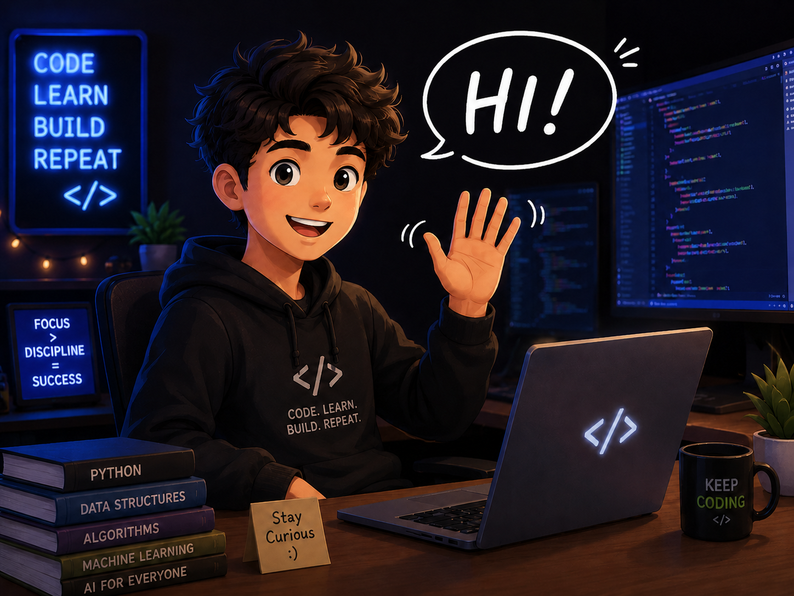

  

<table>
<tr>
<td width="60%" valign="middle">

## Welcome to my page!
**Sophomore @BIT'29 — Artificial Intelligence & Data Science**

- 🌱 Learning **C++, Python, SQL, DSA & Machine Learning**
- 🤝 Interested in AI, Data Science & Open Source
- 🚀 Building projects one step at a time
- ⚡ *Turning curiosity into projects.*

</td>
<td width="40%" align="center" valign="middle">

</td>
</tr>
</table>

# 💻 Tech Stack

  
  
  
  
  
  
  
  
  
  

# 📊 GitHub Stats:
 
 

# 🌐 Connect

  

  

  

  

  

> Learn continuously. Build consistently. Grow endlessly.

